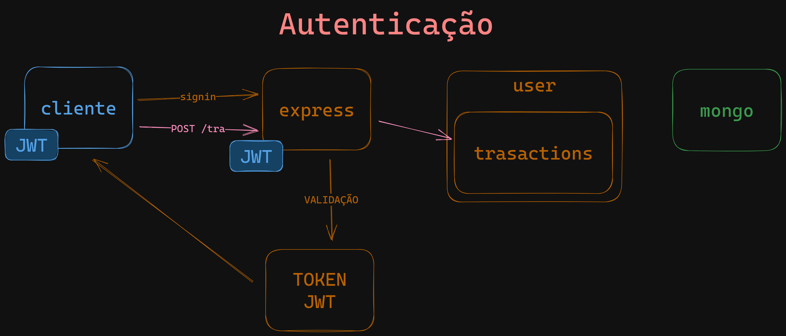

# wallet-api
##
### Setup de um projeto Node com Express:
Github: https://github.com/brunasiaovn

Node: https://nodejs.org/en

VsCode: https://code.visualstudio.com/

Express: https://expressjs.com/pt-br/

Nodemon: https://nodemon.io/
##
### Arquitetura de software:
Sugestão de Livro: Arquitetura limpa: O guia do artesão para estrutura e design de software
##
### Setup do MongoDB Atlas no Express:
Mongodb Atlas: Cloud: MongoDB Cloud
##
### Variáveis de ambiente:
Dotenv: npm: dotenv
##
### Criptografia de senha com bcrypt:
npm: bcrypt
##
### Introdução a autenticação com JWT:

##
### Gerando um token JWT no signin do usuário:
JWT: JWT.IO - JSON Web Tokens Introduction

Hash SHA256 SHA256 Online
##
### Validação de schemas com Joi:
joi.dev
